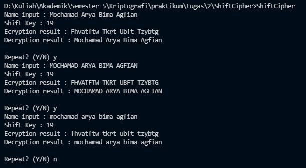

# Mochamad Arya Bima Agfian  

## 140810190031  

## Kelas A  

---

### Inputs and Outputs  

Input :  

1. **String** : Name or any sentences to be encrypted.  
`Words encryption are limited to Alphabetical letters (e.g. A-Z and a-z)`  
2. **Shift Key** : Amount of shift used as encryption matter.  
`Input integer are limited to non-negatives only.`  

Output :  

1. **String** : Encrypted Cipher text.  Result of encryption letter to plain text using shift key.  
2. **String** : Decrypted Plain text. Result of decrypted letter as the initial plain text.  

---
Source File : [ShiftCipher](ShiftCipher.cpp)  

How to Run :  Compile using gcc / GNU Make  

```cmd
g++ ShiftCipher.cpp -o ShiftCipher
```  

or

```cmd
make ShiftCipher
```

Then simply run the program on terminal

```cmd
ShiftCipher
```

---  
Screenshot Output Program  
  
